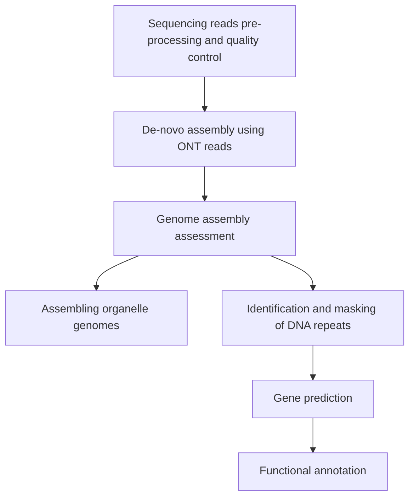

© 2026 Abdoallah Sharaf

### Genome assembly and annotation workflow 



# Sequencing reads pre-processing and quality control
> **Exercise:** Check the mini-ONT output directory structure and run's report. Let's see if you'd be able to use your CL skills to navigate through the output directory, check data size, and final merge sequencing raw reads.


- from now on, i will adopt the strategy of "one environment per step", if you work on your PC then you are supposed to:
    
    - create your environment of each step using the packages list file ```conda_packages.yml``` which is placed in the ```Results``` directory. 
      You can install the list of packages using:
      ````bash
      mamba env create -n [eviroment_name] -f conda_packages.yml
      ````
     
    - I placed the pre-produced results for each step to save time. Also, i created all the necessary environments, you need just to activate them following the tutorial.   
 

> **Exercise:** Check the number of the raw reads 


- As we dealing with a very high number of reads, then I subset ```400000``` of reads so that you can run each analysis over it while the pre-produced results are based on the full set of data. Then don't expect that all analysis would work for you.

> **Exercise:** Create a directory with your name and create a symlink to the subsetted reads ```raw_ONT/Aip_sub_400K.fastq.gz```.

## Quality Control: 

Assess the quality of the raw nanopore reads using tools like FastQC or NanoPlot to identify any issues needing attention.

- We will Use [NanoPlot](https://github.com/wdecoster/NanoPlot) to test the quality of the sequencing read. 

````bash
mamba activate qc_env
````
Running time: 25m47,291s 

````bash
NanoPlot --fastq [raw_reads].fastq.gz --maxlength 40000 --plots dot --legacy hex -o nanoplot
````
> **Exercise:** Check out some of the .png plots and the contents of ```NanoStats.txt```. Also, download ```NanoPlot-report.html``` for both files to your local computer and answer the following questions:

A. How many reads are in the files?

B. What are the average read lengths? What does this tell us about the quality?

C. What is the average base quality and what kind of accuracy do we expect?


<details>
<summary>Hint</summary>

```
error probability (p) =10^(−Q/10) ×100%
  Where: Q is the Quality Value.
```
</details>

## Adapter Removal using PoreChop: 

(execution time: 156m30,495s)
````bash
porechop -i [raw_reads].fastq.gz -o [clean_reads].fq --discard_middle

gzip [clean_reads].fq
````

> **Exercise:** Check the read quality after adapter removal and download the html files from the server. do you notice differences?
